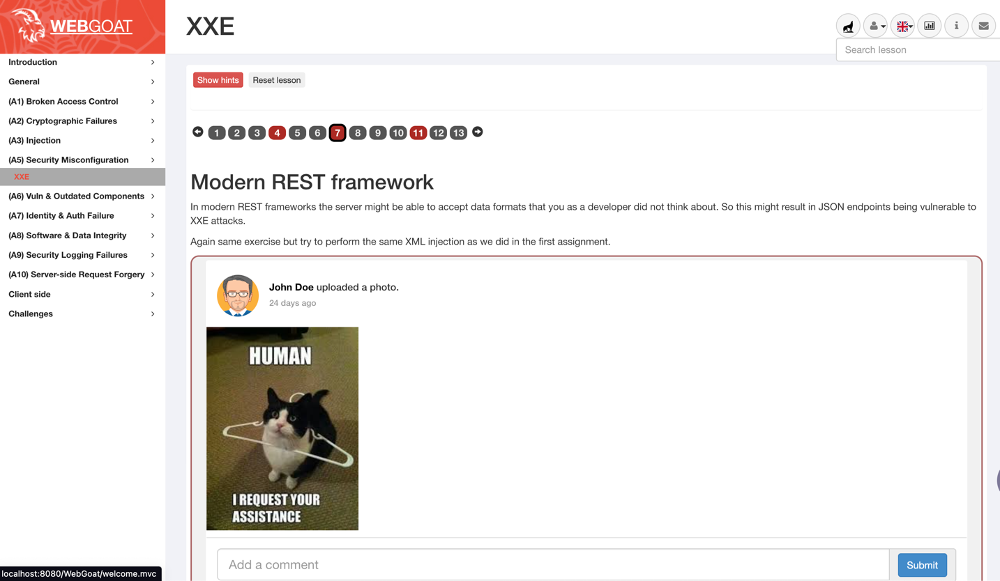

# OWASP WebGoat Indra Fork 

Aplicación que se basa en el proyecto https://github.com/WebGoat/WebGoat, el cual tiene de manera deliberada muchas vulnerabilidades actuales del mercado y pretendemos identificar con el escaneo con SonarQube, como ejercicio práctico en la comunidad Java Indra Colombia.

**WebGoat** es una aplicación web de código abierto desarrollada por OWASP que se utiliza para enseñar y practicar técnicas de seguridad web. Sirve como una plataforma educativa para aprender sobre vulnerabilidades comunes y cómo explotarlas, así como para comprender cómo proteger las aplicaciones contra estos ataques. Se puede utilizar junto con herramientas como SonarQube para analizar y mejorar la seguridad del código, identificando y solucionando problemas de seguridad potenciales.

## Tecnologías que utiliza
- Java 17 o 21
- Maven
- IDE preferido
- Git o Git suportado en IDE

# Introduction

WebGoat es una aplicación web deliberadamente insegura mantenida por [OWASP](http://www.owasp.org/) diseñada para enseñar web
lecciones de seguridad de aplicaciones.

Este programa es una demostración de fallas comunes en las aplicaciones del lado del servidor. El
Los ejercicios están destinados a ser utilizados por personas para aprender sobre la seguridad de las aplicaciones y
Técnicas de pruebas de penetración.

**ADVERTENCIA 1:** *Mientras ejecuta este programa, su máquina estará extremadamente
vulnerable al ataque. Debes desconectarte de Internet mientras usas
este programa.* La configuración predeterminada de WebGoat se vincula a localhost para minimizar
La exposición.

**ADVERTENCIA 2:** *Este programa es solo para fines educativos. si intentas
estas técnicas sin autorización, es muy probable que te atrapen. Si
Si lo descubren participando en piratería no autorizada, la mayoría de las empresas lo despedirán.
Afirmar que estaba haciendo una investigación de seguridad no funcionará ya que esa es la
Lo primero que afirman todos los piratas informáticos.*




## Inicio rápido

```bash
git clone https://github.com/rahozindracompany/owasp-web-goat.git
cd owasp-web-goat
mvn clean install
mnv sonar:sonar
mvn spring-boot:run
```
Abrir URL en navegador:

 http://localhost:8080/WebGoat